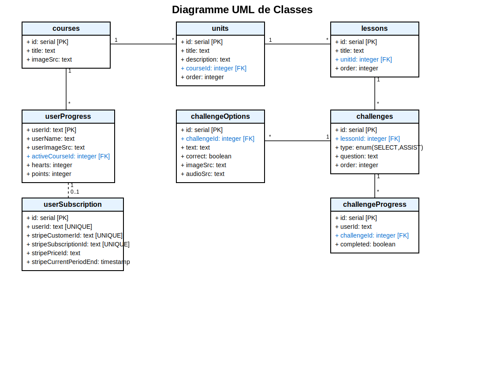

# Kursus

Kursus est un site de formation en ligne conçu pour offrir une expérience d'apprentissage enrichissante et accessible.

## Fonctionnalités
- Accès à des cours en ligne.
- Gestion des utilisateurs et des inscriptions.
- Suivi des progrès des apprenants.

## Diagramme UML
Voici la classe UML du projet :



## Installation
1. Clonez le dépôt :  
    ```bash
    git clone https://github.com/armelgeek/Kursus
    ```
2. Installez les dépendances :  
    ```bash
    npm install
    ```
3. Lancez le projet :  
    ```bash
    npm start
    ```

## Contribution
Les contributions sont les bienvenues ! Veuillez soumettre une pull request pour toute amélioration ou correction.

## Licence
Ce projet est sous licence MIT.